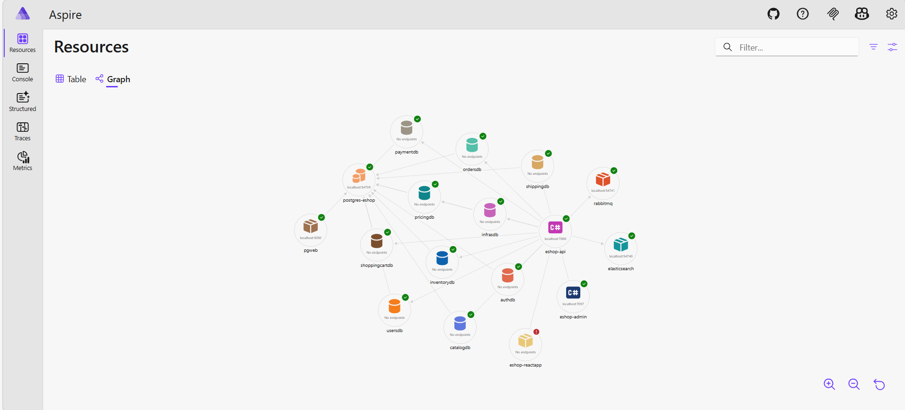
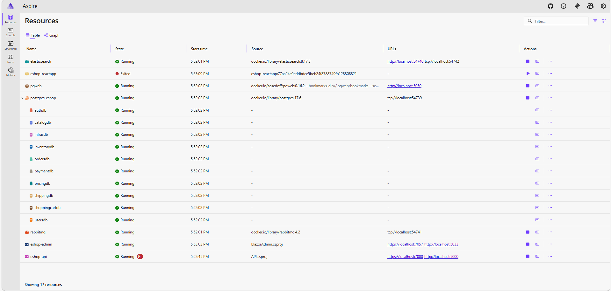
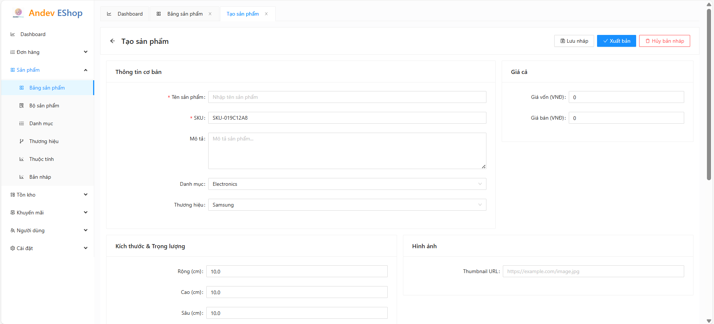
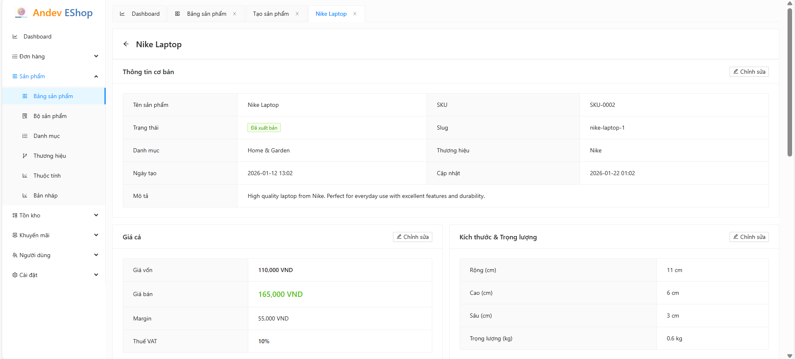
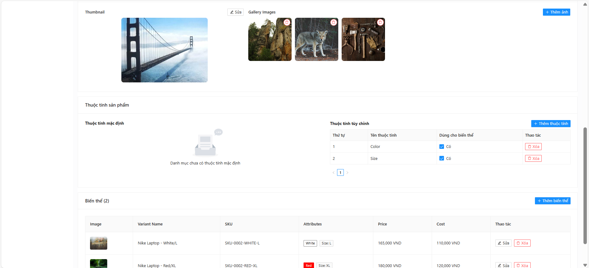
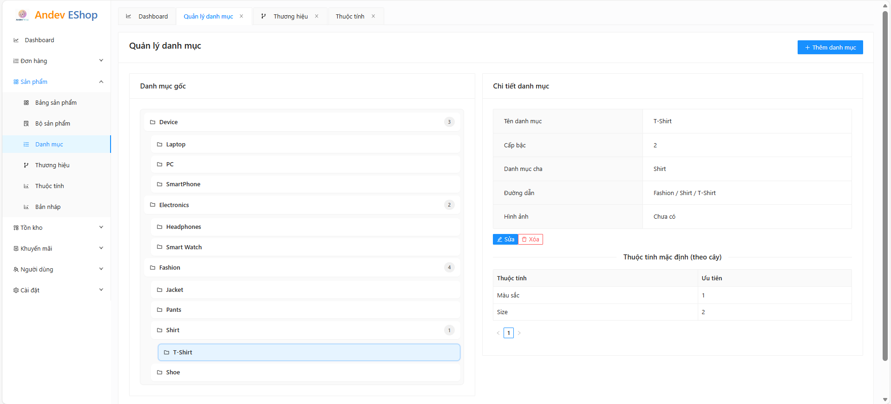
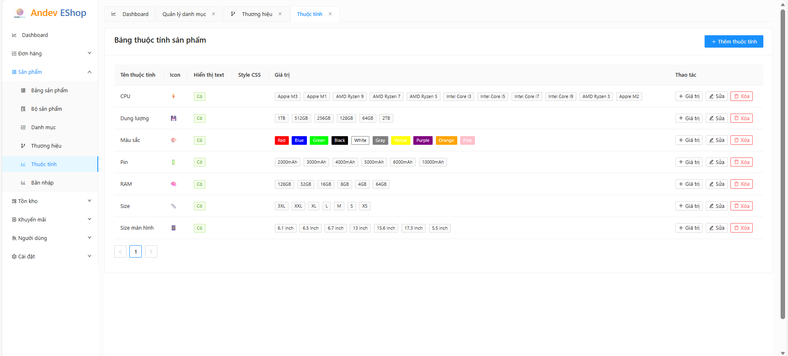

# E-Shop Modular Monolith

[](https://dotnet.microsoft.com/)
[](https://dotnet.microsoft.com/apps/aspnet)
[](LICENSE)

Dự án **E-Shop Modular Monolith** là một hệ thống thương mại điện tử được thiết kế để bán tất cả loại sản phẩm với các biến thể và thuộc tính đa dạng. Dự án được xây dựng theo kiến trúc **Modular Monolith** hiện đại, kết hợp với **Domain Driven Design (DDD)** và **Event-Driven Architecture** để đảm bảo tính mở rộng, bảo trì, sẵn sàng nâng cấp các thành phần cần thiết thành microservices.

## Mục lục

- [Tính năng chính](#tính-năng-chính)
- [Công nghệ áp dụng](#công-nghệ-áp-dụng)
- [Mẫu kiến trúc và triết lý thiết kế](#mẫu-kiến-trúc-và-triết-lý-thiết-kế)
- [Vai trò các module](#vai-trò-các-module)
- [ERD các module](#erd-các-module)
- [Hướng dẫn cài đặt và chạy dự án](#hướng-dẫn-cài-đặt-và-chạy-dự-án)
- [Link Demo](#demo)
- [Hình ảnh mẫu](#hình-ảnh-mẫu)

## Tính năng chính

-  **Quản lý sản phẩm**: Hỗ trợ sản phẩm với nhiều biến thể và thuộc tính
-  **Quản lý người dùng**: Hệ thống xác thực và phân quyền
-  **Giỏ hàng và thanh toán**: Quy trình mua hàng hoàn chỉnh
-  **Quản lý đơn hàng**: Theo dõi và xử lý đơn hàng
-  **Tìm kiếm nâng cao**: Sử dụng Elasticsearch để nâng cao trải nghiệm tìm kiếm của người dùng
-  **API RESTful**: Thiết kế theo chuẩn REST
-  **Hướng sự kiện**: Đồng bộ dữ liệu và cross-module với RabbitMQ

## Công nghệ áp dụng

### Core Technologies

- **SDK**: .NET 10.0
- **Framework**: ASP.NET Core Web API, Aspire
- **Database**: Postgresql với Entity Framework Core
- **Message Broker**: RabbitMQ với MassTransit
- **Search Engine**: Elasticsearch
- **Container**: Docker

### Libraries & Tools

| Thư viện | Mục đích | Phiên bản |
|----------|----------|-----------|
| **Entity Framework Core** | ORM và Database Access | 10.0+ |
| **MediatR** | CQRS và Mediator Pattern | 12.5.0 |
| **FluentValidation** | Validation Rules | 12.1.1 |
| **AutoMapper** | Object Mapping | 14.0+ |
| **MassTransit** | Message Broker | 8.0+ |
| **Serilog** | Structured Logging | 3.0+ |
| **Swagger/OpenAPI** | API Documentation | 10.0+ |
| **xUnit** | Unit Testing | 2.9.3 |
| **Moq** | Unit Testing | 4.20.72 |
| **FluentAssertions** | Unit Testing | 7.2.0 |
| **Aspire.Hosting.Docker** | Hỗ trợ Deploy | 13.0 |
| **Aspire.Hosting.PostgreSQL** | Hỗ trợ Database | 13.0 |
| **Aspire.Hosting.Elasticsearch** | Hỗ trợ ES | 13.0 |
| **Aspire.Hosting.RabbitMQ** | Hỗ trợ RabbitMQ | 13.0 |
## Mẫu kiến trúc và triết lý thiết kế

### 1. Modular Monolith Architecture

```
📁 src/
├── API/                    # API Gateway (ASP.NET Core)
├── Aspire/                 # Cài đặt môi trường tài nguyên hạ tầng, điều phối ứng dụng và quản lý tập trung
├── Auth/                   # Xác thực / Phân quyền
├── BlazorAdmin/            # Frontend quản trị cho Admin
├── Modules/                # Các module nghiệp vụ
│   ├── Catalog/            # Quản lý sản phẩm
│   ├── Inventory/          # Quản lý kho
│   ├── Orders/             # Xử lý đơn hàng
│   ├── Payment/            # Xử lý thanh toán
│   ├── Pricing/            # Quản lý giá, coupon và khuyến mãi
│   ├── Report/             # Thống kê và báo cáo
│   ├── Shipping/           # Quản lý giao hàng
│   ├── ShoppingCart/       # Quản lý giỏ hàng
│   └── Users/              # Quản lý người dùng
├── Shared/                 # Chia sẻ giữa các module
│   ├── Contracts/          # DTOs công khai và Events
│   ├── Infrastructure/     # Hạ tầng chung (EF Core, Messaging, Caching ...)
│   └── Kernel/             # Abstractions cốt lõi, thư viện framework
📁 Tests/                   # Unit & Integration Tests
```

**Lợi ích:**
- Tiết kiệm RAM và CPU, đơn giản hóa deployment khi chưa có nhu cầu mở rộng
- Chia sẻ code, dễ bảo trì.
- Tách biệt trách nhiệm theo tinh thần của hệ thống phân tán, dễ dàng chuyển đổi thành microservice khi cần mở rộng.

### 2. Clean Architecture

Mỗi module tuân theo nguyên tắc **Clean Architecture**:

```
📁 Module/
├── Domain/                 # Business Logic & Entities
├── Application/            # Commands/Queries áp dụng Vertical Slide và các Event handlers
└── Infrastructure/         # External Concerns (DB, APIs, ...)
```

### 3. Domain Driven Design (DDD)

- **Rich Domain Entities**: Entities chứa business logic
- **Value Objects**: Immutable objects biểu diễn concepts
- **Aggregates**: Nhóm entities với consistency boundaries
- **Domain Events**: Business events cho decoupling
- **Repositories**: Abstract data access

### 4. Event-Driven Architecture

- **CQRS Pattern**: Command Query Responsibility Segregation
- **Domain Events**: Loose coupling giữa modules
- **Integration Events**: Cross-module communication
- **Eventual Consistency**: Asynchronous processing


## Vai trò các module

### Core Modules

| Module | Trách nhiệm | Database |
|--------|-------------|----------|
| **Catalog** | Quản lý sản phẩm, danh mục & thương hiệu | CatalogDb |
| **Inventory** | Quản lý tồn kho | InventoryDb |
| **Orders** | Quy trình đơn hàng | OrderDb |
| **Payment** | Giao dịch thanh toán | PaymentDb |
| **Shipping** | Giao hàng | ShippingDb |
| **ShoppingCart** | Quản lý giỏ hàng | ShoppingCartDb |
| **Pricing** | Log thay đổi giá, Chiến dịch khuyến mãi, Coupon | PricingDb |
| **Report** | Báo cáo doanh thu, Phân tích | ReportDb |

### Shared Components

| Component | Mục đích |
|-----------|----------|
| **Contracts** | DTOs, Integration Events, Command và Queries |
| **Kernel** | Base classes, abstractions, extensions, tiện ích |
| **Infrastructure** | Caching, File Storage, Notification, EventBus, EF Base classes |

## ERD các module

Sơ đồ quan hệ thực thể (ERD) của từng module (Catalog, Inventory, Orders, Payment, Pricing, Shipping, ShoppingCart, Users) được mô tả trong file riêng:

**[→ ERD các module (documents/erd.md)](documents/erd.md)**

Các sơ đồ phản ánh domain của từng module (aggregates và entities). Các tham chiếu ID sang module khác (ví dụ `ProductId`, `OrderId`) mang tính logic; mỗi module dùng database riêng.

## Hướng dẫn cài đặt và chạy dự án

### Prerequisites

- [.NET 10.0 SDK](https://dotnet.microsoft.com/download/dotnet/10.0)
- **Visual studio 2022+**
- **Docker Desktop** (để chạy các dịch vụ hạ tầng như Postgresql, RabbitMQ, Elasticsearch)

### 1. Clone Repository

```bash
git clone https://github.com/your-username/e-shop-modular-monolith.git
cd e-shop-modular-monolith
```
### 2. Mở Solution
mở file **EShop_ModularMonolith.slnx**

### 3. Cấu hình Environment Variables

Tạo file `appsettings.Development.json` trong thư mục `src/API/`, ghi đè các ApiKey và secret

### 4. Chạy ứng dụng
- Đảm bảo Docker Desktop đang chạy
- Chọn Aspire.AppHost làm startup project và Run

### 5. Truy cập Aspire dashboard


## Demo

- **Web Demo**: [https://annghdev.online](https://annghdev.online)
- **Video Demo**: [YouTube](https://youtube.com/watch?v=...)

## Hình ảnh mẫu

### Database Schema


### Aspire Dashboard



### Blazor Admin Panel

| Bảng sản phẩm | Tạo sản phẩm (draft) |
| :---: | :---: |
|  |  |

| Chi tiết sản phẩm | tiết sản phẩm (cuộn xuống) |
| :---: | :---: |
|  |  |

| Cây danh mục | Bảng thuộc tính |
| :---: | :---: |
|  |  |

---

## Đóng góp

Rất hoan nghênh mọi tinh thần đóng góp! Bạn có thể tạo Issue và tạo PR nếu muốn.

## Giấy phép

Dự án này được phân phối dưới giấy phép MIT. Xem file [LICENSE](LICENSE) để biết thêm chi tiết.

## Liên hệ

- **Email**: annghdev@gmail.com
---

⭐ **Star this repo** nếu bạn thấy dự án hữu ích!
