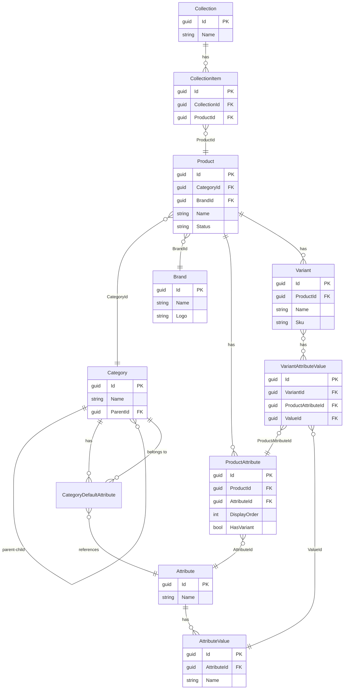
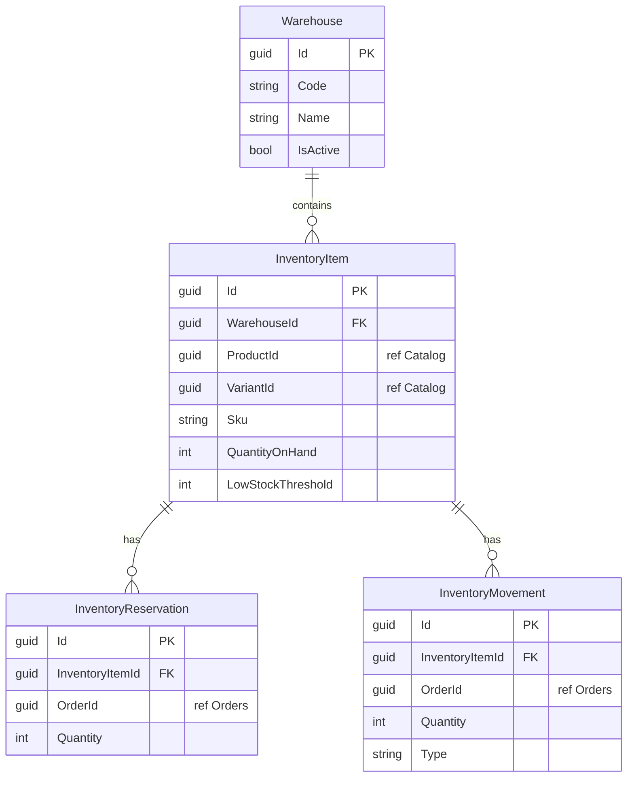
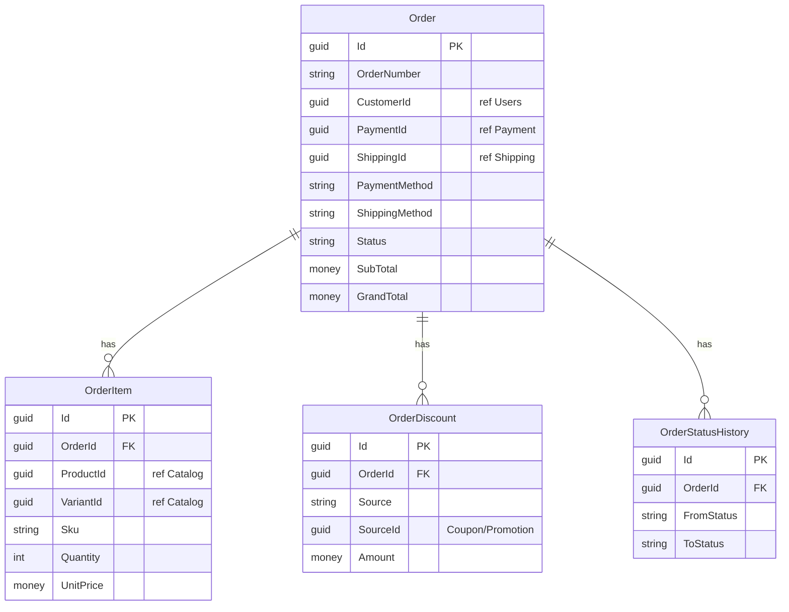
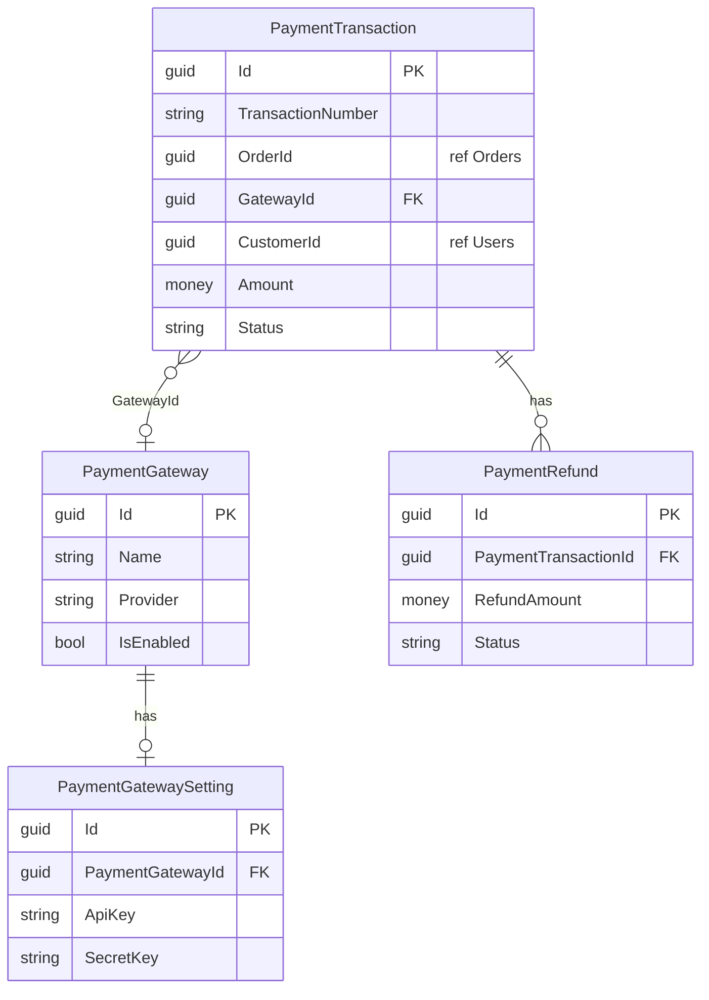
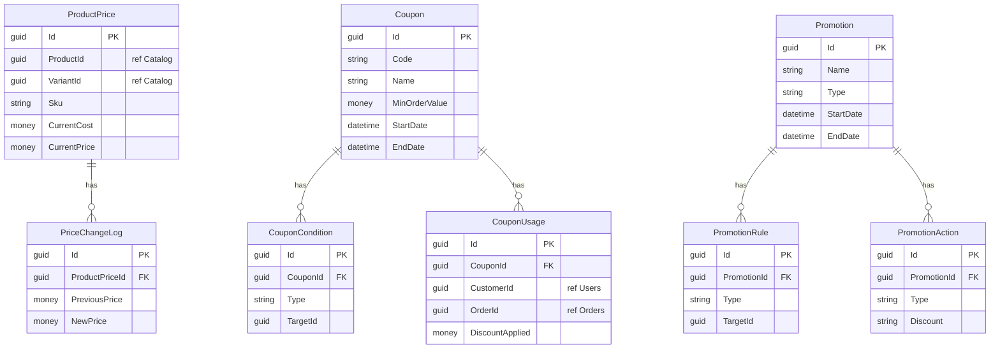
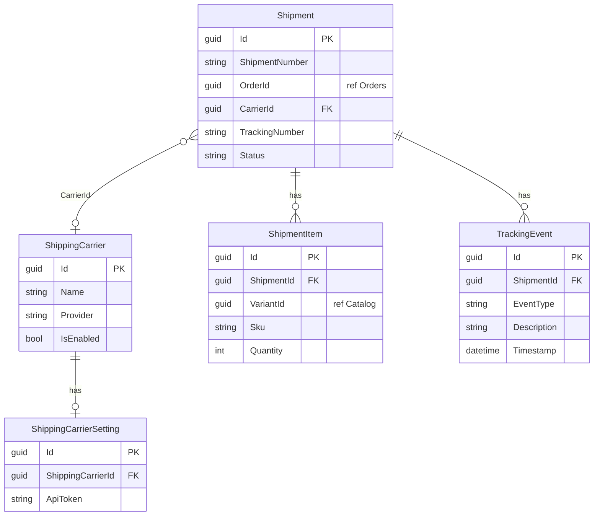
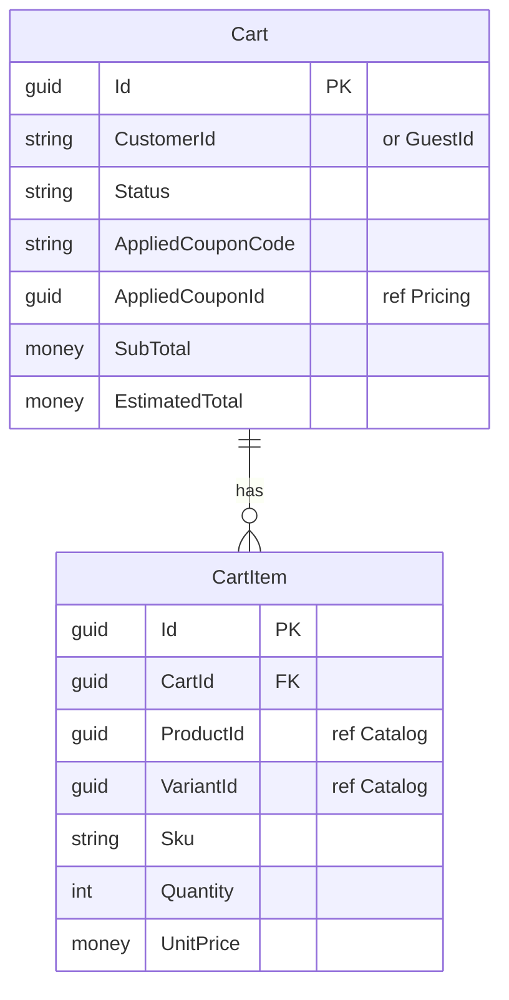
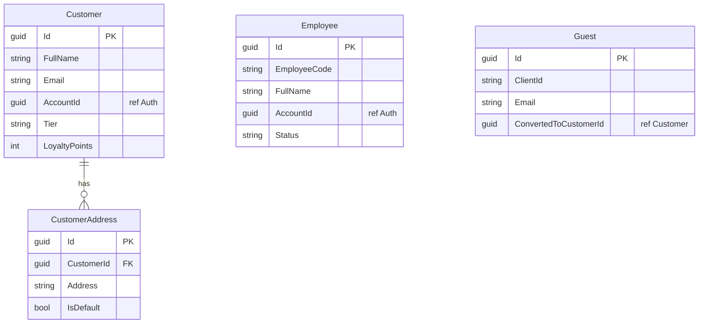

# Module ERDs

Entity-Relationship diagrams below reflect each module's domain (aggregates and entities). References to IDs from other modules (e.g. `ProductId`, `OrderId`) are logical; each module uses its own database.

## Catalog (CatalogDb)

Product catalog: categories (tree), attributes/values, brands, products with variants and product attributes, collections.

## Inventory (InventoryDb)

Warehouses and inventory items per variant; reservations for orders; movement log.

## Orders (OrderDb)

Orders with items, discounts (coupon/promotion), and status history.

## Payment (PaymentDb)

Payment gateways with settings; transactions and refunds linked to orders.

## Pricing (PricingDb)

Product/variant prices with change log; coupons with conditions and usages; promotions with rules and actions.

## Shipping (ShippingDb)

Carriers with settings; shipments per order with items and tracking events.

## ShoppingCart (ShoppingCartDb)

Carts (customer or guest) and cart items; optional applied coupon.

## Users (UsersDb)

Customers with addresses; employees; guests (anonymous). References to Auth (AccountId) are logical.

